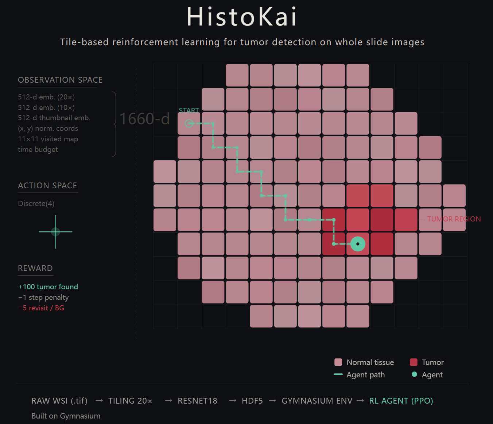

# HistoKai

**A Tile-Based Reinforcement Learning Environment for Tumor Detection on Whole Slide Images**



HistoKai implements a Gymnasium-compatible RL environment that formulates tumor detection in digital pathology as a navigation task. An agent moves across a grid of pre-extracted tiles on a Whole Slide Image (WSI), learning to locate tumor regions using only local histological features — without direct access to tumor location labels at inference time.

The project covers the full pipeline from raw WSI preprocessing to RL training:

```
Raw WSI (.tif) → Tiling (20×/10×) → ResNet18 Embedding → HDF5 Database → Gymnasium Env → RL Agent (PPO)
```

Built on the [Camelyon16](https://camelyon16.grand-challenge.org/) dataset (breast cancer lymph node metastasis detection), a standard WSI benchmark.

---

## Environment Overview: `wsi_env.py`

`WSIEnv` is a custom [Gymnasium](https://gymnasium.farama.org/) environment where the agent navigates a tile-grid world derived from a single WSI.

**Key design:**

| Component | Description |
|-----------|-------------|
| **Grid World** | 20× magnification tiles (224×224 px) on a 2D grid; only tissue tiles are traversable |
| **Observation** | 1660-d vector = 512×3 (20× + 10× + thumbnail embeddings) + 2 (normalized coords) + 121 (11×11 local visited map) + 1 (time budget) |
| **Action Space** | `Discrete(4)` — up / down / left / right (optionally `Discrete(5)` with a STOP action) |
| **Reward** | Configurable: step penalty, background/revisit penalties, large positive reward upon reaching tumor |
| **Starting Modes** | `fixed` · `distance_band` · `random_tissue` — supports curriculum learning |
| **Embeddings** | Pre-computed via Self-Supervised and ImageNet-pretrained ResNet18 |

The environment loads all data from a single HDF5 file per WSI, enabling fast reset with zero disk I/O during episodes.

> **Tutorial →** See [WSI_Env_Tutorial.ipynb](WSI_Env_Tutorial.ipynb) for a step-by-step walkthrough covering environment creation, observation decomposition, grid visualization, reward mechanics, starting strategies, and Stable-Baselines3 integration.

---

## Notebooks (Implementation & Experiments & Analysis)

### (1) Tile Visualization

[`(1)tile_visualization.ipynb`](<(1)tile_visualization.ipynb>)

Visualizes the WSI tiling process. Opens a `.tif` slide with OpenSlide, overlays the tile grid at 20× magnification, and inspects individual tiles. Provides an intuitive understanding of how a WSI is decomposed into the grid that forms the RL environment.

### (2) WSI Preprocessing

[`(2)wsi_preprocessing.ipynb`](<(2)wsi_preprocessing.ipynb>)

The core data pipeline notebook. For each WSI in the Camelyon16 training set:

1. **Tiling** — Extracts 224×224 tiles at 20× and corresponding context patches at 10×
2. **Tissue Masking** — Generates a binary tissue mask resized to tile-grid resolution
3. **Tumor Masking** — Parses annotation XML files to create per-tile tumor labels (area threshold 0.3)
4. **Embedding** — Computes 512-d feature vectors using both Self-Supervised and ImageNet-pretrained ResNet18
5. **HDF5 Storage** — Writes all embeddings, coordinates, masks, and metadata into one `.h5` file per slide

Produces the `tile_database/tumor_*.h5` files consumed by `WSIEnv`.

### (3) Annotation & Tile Visualization

[`(3)annotation_tile_visualization.ipynb`](<(3)annotation_tile_visualization.ipynb>)

Overlays tumor annotations on the tile grid. For a given WSI:

- Displays the full slide with tumor region outlines
- Zooms into each tumor region, showing tile-level tumor/normal labels on the grid
- Extracts tile embeddings and produces UMAP dimensionality reduction plots, visualizing the feature-space separation between tumor and normal tiles

Useful for verifying annotation quality and assessing whether the embedding space carries discriminative signal.

### (4) HDF5 Database Test

[`(4)h5_database_test.ipynb`](<(4)h5_database_test.ipynb>)

Sanity-checks the HDF5 databases produced by notebook (2). Inspects dataset shapes, attribute values, embedding statistics, and mask distributions. Confirms data integrity before proceeding to RL training.

### (5) RL Setup & Single WSI

[`(5)RL_setup_and_Single_WSI.ipynb`](<(5)RL_setup_and_Single_WSI.ipynb>)

The first RL experiment. Trains a PPO agent on a **single WSI with fixed starting positions** near the tumor boundary (3–5 BFS steps away). Validates that:

- The Gymnasium environment is correctly wired (passes `check_env`)
- The RL pipeline converges — reward increases and episode length decreases over training
- The agent learns short-range navigation to tumor regions

This serves as the baseline proof that the environment and training loop function correctly, before scaling to harder settings.

### (6) Single WSI Curriculum

[Currently Not Provided]

Scales up from fixed starts to random starting positions on the same WSI, testing whether the agent can navigate to tumor from increasing distances. Two training strategies are compared:

- **Sequential Curriculum** (Sections 1–7): Trains in stages — 2a (3–5 BFS steps) → 2b (10–20) → 2c (all tissue) — with automatic promotion at 70% success rate. Result: *catastrophic forgetting* — later stages destroy earlier learned policies, final model drops to 32%/8%/2% across the three distance pools.
- **Mixed-Distance Training** (Section 8): Samples starting positions uniformly from all tissue tiles in a single training phase, with a wider network (256-256). Numerically better (48%/20%/6%), but trajectory analysis reveals the agent simply learned a fixed "go down" strategy — all successful episodes are straight vertical lines.

Core finding: The observation space (tile embeddings + coordinates + visited map) encodes *what tissue looks like*, not *where tumor is relative to the agent*. On Camelyon16, normal tissue embeddings are nearly indistinguishable regardless of proximity to tumor, leaving the agent no directional signal to learn from. This is an information-theoretic bottleneck, not a training strategy issue.

### (6_1) Single WSI Curriculum — Control Experiment

[Currently Not Provided]

A **controlled-variable follow-up** to notebook (6), designed to rule out alternative explanations for the failure:

| Potential Confound in (6) | How (6_1) Addresses It |
|--------------------------|----------------------|
| Distance gap too large (3-5 → 10-20, skipping 5-10) | Smooth progression: 3-5 → 5-10 → 10-20 |
| Training budget too small (200K–500K per stage) | 1,000,000 steps per stage (3M total) |
| Multiple variables changed at once in (6) Section 8 | All hyperparams/architecture unchanged — only distance granularity and budget differ |

Additionally introduces systematic cross-stage forgetting detection (each model evaluated on all prior distance pools) and batch trajectory export (30 PNGs per stage for per-episode inspection).

Result: The agent still learns only a fixed-direction policy at each stage (e.g., "always go up" in 2a, "always go left" in 2b). Cross-stage success rates cluster around 35–58% with no qualitative improvement. This definitively closes the "inadequate training" alternative hypothesis and confirms the observation space information bottleneck identified in (6).

### (7) RecurrentPPO

[Currently Not Provided]

Tests whether **sequential memory** (LSTM) can extract directional signal from observation history. Uses RecurrentPPO ([SB3-Contrib](https://sb3-contrib.readthedocs.io/)) with the same mixed-distance training as (6) Section 8.

| Model | Architecture | Params | 2a (3-5) | 2b (10-20) | 2c (all tissue) |
|-------|-------------|--------|----------|------------|-----------------|
| MLP-PPO (NB6) | [256,256] MLP | ~1M | 48% | 20% | 6% |
| RecurrentPPO | [256,256] + LSTM(256) | 4.2M | 54% | 28% | 20% |

RecurrentPPO improves success rates across all distance ranges (most notably +233% relative on 2c). However, trajectory visualization reveals the same pattern: successful episodes are still straight lines going downward. The LSTM enables the agent to maintain its chosen direction more consistently (fewer mid-trajectory oscillations), but does not enable actual directional navigation.

Conclusion: The failure is not due to lack of temporal memory — even with full observation history, there is no directional gradient in the embedding space for the LSTM to exploit on this dataset. The bottleneck lies in the observation content, not the policy architecture.

---

## HDF5 Database Schema

Each `tile_database/{slide_id}.h5` follows this structure:

```
{slide_id}.h5
├── embeddings_20x_s   (N, 512) float32   # Self-Supervised ResNet18, 20× tiles
├── embeddings_10x_s   (N, 512) float32   # Self-Supervised ResNet18, 10× context
├── embeddings_20x_i   (N, 512) float32   # ImageNet-pretrained ResNet18, 20× tiles
├── embeddings_10x_i   (N, 512) float32   # ImageNet-pretrained ResNet18, 10× context
├── coords             (N, 2)   int32     # Level-0 pixel coordinates per tile
├── tissue_mask        (N,)     bool      # Is tissue?
├── tumor_mask         (N,)     bool      # Is tumor? (area threshold 0.3)
├── thumbnail          (H,W,3)  uint8     # Low-res slide thumbnail
├── thumbnail_embedding_s  (512,) float32 # Thumbnail embedding (Self-Supervised)
├── thumbnail_embedding_i  (512,) float32 # Thumbnail embedding (ImageNet)
└── attrs
    ├── tile_size          224
    ├── level_20x          int
    ├── level_10x          int
    ├── mpp                float
    └── slide_dimensions   (W, H)
```

---

## Environment Setup

```bash
conda env create -f environment.yml
conda activate wsi-rl
```

**Data:** Place Camelyon16 training slides (`.tif`) in `data/camelyon16/training/tumor/` and annotations (`.xml`) in `data/camelyon16/annotations/`. Run notebook (2) to generate the HDF5 tile databases (and notebook (3) to add `tumor_mask: (N,) bool` field).

**Pre-trained weights (ResNet18):** Normally we use ImageNet-pretrained weights. With domain-specific pretraining, download the self-supervised ResNet18 checkpoint to `pre_trained_resnet/self-supervised-histopathology/pytorchnative_tenpercent_resnet18.ckpt` (from [ozanciga/self-supervised-histopathology](https://github.com/ozanciga/self-supervised-histopathology)).

---
